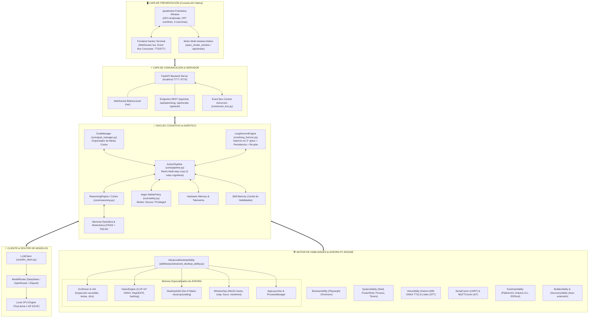

# 🏛️ WIS v2.0 — Arquitectura del Sistema Cognitivo AGI

**WIS (Wisdom Integrated System)** es un sistema operativo cognitivo y agente autónomo de alto rendimiento diseñado para ejecución de metas de largo horizonte, automatización profunda de escritorio/PC, visión artificial y telemetría hardware en tiempo real.

---

## 1. Diagrama de Arquitectura Global

---

## 2. Componentes Principales

### 2.1. Núcleo Cognitivo y Loop Agéntico (`core/`)

- **`ActionPipeline` ([core/pipeline.py](file:///d:/WIS/core/pipeline.py)):**
  Implementa un bucle cognitivo multi-paso tipo ReAct estructurado en tres rutas:
  1. **Fast-Path:** Acciones reflejas de baja latencia basadas en memoria de hardware.
  2. **Known-Path:** Tareas conocidas cacheadas en `SkillMemory`.
  3. **New-Path:** Razonamiento profundo multi-paso con descomposición de planes, ejecución de herramientas y autocorrección de fallos.
- **`Aegis Safety Policy` ([core/safety.py](file:///d:/WIS/core/safety.py)):**
  Políticas de contención y seguridad. Modos `secure` (requiere aprobación explícita del operador para acciones críticas) y `privileged` (autónomo para automatización total de escritorio).
- **`Memory` & `Mnemonic` ([core/memory.py](file:///d:/WIS/core/memory.py)):**
  Base de datos híbrida basada en SQLite y vector store FAISS con embeddings locales (`fastembed` / `all-MiniLM-L6-v2`) para retención de hechos a largo plazo.

---

### 2.2. Motor de Tareas de Largo Horizonte (`core/long_horizon.py`)

Diseñado para misiones complejas que pueden durar minutos u horas (análisis de repositorios, scraping masivo, automatización de suites de software):
- **Daemon Mode:** Se ejecuta en un hilo del sistema operativo con su propio bucle de eventos `asyncio`, persistiendo incluso si la consola visual se cierra.
- **Persistencia en Disco:** Guarda el estado en `Data/tasks/<task_id>/state.json` y el diario cronológico en `journal.jsonl`.
- **Re-planificación Semántica:** Ante el fallo de una subtarea, consulta al LLM con el error ocurrido para generar un sub-plan de contingencia sin detener la misión general.
- **Eventos en Tiempo Real:** Emite a través de `event_bus` eventos consumidos por la interfaz (`long_horizon.step_start`, `long_horizon.step_done`, `long_horizon.plan_ready`).

---

### 2.3. Motor de Habilidades AVRORA PC (`abilities/pc/`)

WIS absorbe la tecnología del motor AVRORA para control total de Windows:

| Submódulo | Clase Principal | Capacidades Clave |
|---|---|---|
| `advanced_desktop_ability.py` | `AdvancedDesktopAbility` | Fachada unificada que expone 19 acciones al LLM. |
| `gui_driver.py` | `GUIDriver` | Árbol UIA (UIAutomation), simulación de teclado por hardware y clics lógicos. |
| `som.py` | `DesktopSoM` | Set-of-Marks: rotulado visual de botones y controles interactivos en RAM. |
| `vision_engine.py` | `VisionEngine` | Detección visual con CLIP-ViT, extracción de texto con RapidOCR. |
| `window_tools.py` | `WindowOps` | Enfocar, redimensionar, encajar (snap) y listar ventanas visibles. |
| `apps.py` | `AppLauncher` | Búsqueda e indexación dinámica en el registro y menú inicio de Windows. |
| `process.py` | `ProcessManager` | Monitoreo, espera activa y terminación de procesos por PID o nombre. |

---

### 2.4. Consola AGI Nativa y Renderizado Autónomo (`console/`)

- **pywebview Framework:**
  La aplicación corre en una ventana nativa de escritorio sin marcos (`frameless=True`), con aceleración por hardware y fondo negro OLED `#050508`.
- **CSS Titlebar Drag:**
  La barra superior gestiona el arrastre nativo vía `-webkit-app-region: drag`, con orbe interactivo, pills de telemetría y botones de ventana propios.
- **Capacidad Multi-Ventana (`open_render_window`):**
  WIS puede instanciar ventanas emergentes nativas adicionales para mostrar resultados de análisis, diagramas, capturas anotadas SOM o código generado en tiempo real.
- **Canal Bidireccional WebSocket (`/ws`):**
  Comunicación reactiva de ultra-baja latencia con streaming de tokens, estado de razonamiento (`thinking`) y trazas del bus de eventos.
