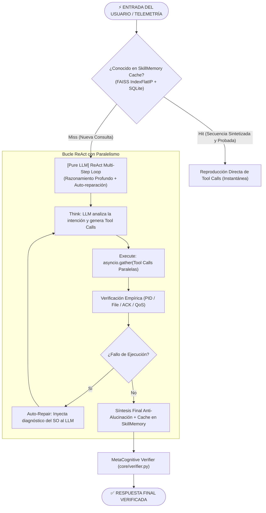
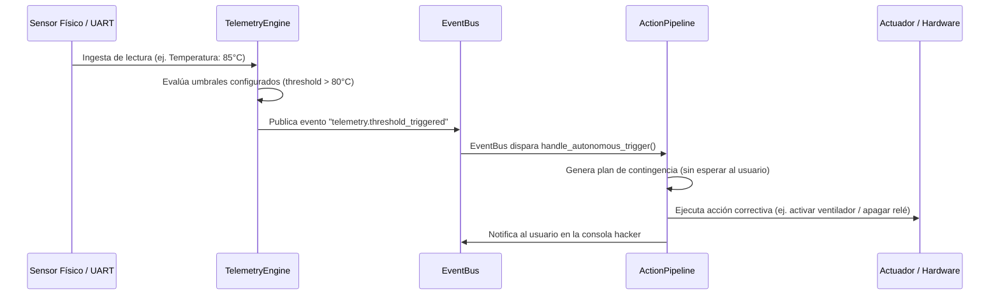

# 🧠 WIS v3.0 — Arquitectura Cognitiva Pure-LLM y Pipeline de Ejecución

El corazón de WIS es su **ActionPipeline** ([core/pipeline.py](file:///d:/WIS/core/pipeline.py)), un motor orquestador basado en la **filosofía pura de AVRORA**:
- **Cero heurísticas hardcoded:** No existen interceptores de expresiones regulares ni atajos que eviten el razonamiento.
- **Todo pasa por el LLM:** Toda solicitud nueva ingresa directamente al bucle ReAct (`think → parallel execute → verify → metacognitive check → repair → synthesize`).
- **Velocidad adquirida dinámicamente:** La única ejecución instantánea proviene de `SkillMemory`, que cachea secuencias completas **únicamente después** de que el LLM las ha probado, verificado empíricamente y sintetizado con éxito.

---

## 1. Flujo Cognitivo Pure-LLM

---

## 2. Detalle de los Caminos Cognitivos

### Path 1: Memoria de Habilidades Sintetizadas (`core/skill_memory.py`)
- **Latencia:** ~10-15 ms.
- **Mecanismo:** Vector Index de alta velocidad basado en **FAISS IndexFlatIP** respaldado por SQLite (`Data/wis_skills.db`).
- **Comportamiento:** Cuando una secuencia multi-paso tiene éxito en el bucle ReAct del LLM, el sistema sintetiza y memoriza el grafo de llamadas resultante. La próxima vez que el usuario solicite la misma tarea (o una semánticamente análoga), se recupera la secuencia exacta ya validada, logrando velocidad instantánea en tareas recurrentes complejas sin depender de heurísticas estáticas.

### Path 2: ReAct Multi-Step Loop Pure-LLM
Toda solicitud nueva pasa directamente por el modelo de lenguaje:
1. **Razonamiento (`core/reasoning.py`):** El LLM genera una secuencia estructurada de llamadas a herramientas (`tool_calls`).
2. **Ejecución Paralela (`asyncio.gather`):** Evalúa las dependencias y despacha herramientas independientes en paralelo (por ejemplo: leer 4 sensores simultáneamente toma el tiempo del más lento, no la suma de todos).
3. **Verificación Empírica:** WIS **no cree ciegamente en lo que el LLM afirma**. Si se lanza un proceso, comprueba `psutil.pid_exists()`. Si se escribe un archivo, comprueba tamaño y hash en disco. Si se envía un byte por UART, espera el ACK físico del microcontrolador. Si se publica por MQTT, valida el ACK de QoS.
4. **Auto-reparación Dinámica:** Si una herramienta devuelve error o no supera la verificación empírica, el error real del sistema operativo se inyecta en el contexto y el modelo formula un plan alternativo de forma autónoma.
5. **Síntesis con Trazabilidad:** La respuesta final se genera forzando un prompt de honestidad alimentado por el trace JSON de las acciones reales ejecutadas.

---

## 3. MetaCognitive Verifier (`core/verifier.py`)

Portado e integrado desde la arquitectura de vanguardia de AVRORA, el **MetaCognitive Verifier** actúa como un árbitro metacognitivo post-síntesis:
- Evalúa si la respuesta generada por el LLM declara falsamente haber completado una acción que en el trace real falló (detección de falsos positivos).
- Evalúa si el LLM afirma que una acción falló cuando en realidad las herramientas se ejecutaron satisfactoriamente (detección de falsos negativos).
- Corrige la salida antes de entregarla al usuario o al WebSocket de la interfaz.

---

## 4. Bucle Autónomo de Telemetría (Closed-Loop Proactivity)

WIS no es solo un asistente reactivo a comandos de texto; posee un lazo de control cerrado con el mundo físico:

---

## 5. Orquestación de Metas de Largo Horizonte

Para tareas que requieren minutos u horas de ejecución sostenida, WIS dispone de dos componentes avanzados:

1. **DAG Mission Planner (`core/mission.py`):**  
   Descompone objetivos masivos en un grafo acíclico dirigido (DAG) de dependencias. Cada nodo representa una etapa verificable con precondiciones y postcondiciones. Si una rama falla, no aborta el sistema completo; replanifica únicamente el subgrafo afectado.

2. **LongHorizonEngine (`core/long_horizon.py`):**  
   Daemon en segundo plano con persistencia en SQLite (`Data/wis_tasks.db`). Permite pausar, reanudar o cancelar misiones, manteniendo un diario de auditoría paso a paso (`journal`) inmune a reinicios del sistema o caídas de conexión.

3. **Swarm Coordinator (`core/swarm.py`):**  
   Permite la orquestación distribuida de múltiples agentes especializados cuando una tarea de desarrollo requiere trabajo simultáneo (ej. generación de tests mientras otro agente refactoriza el código base).

---

## 6. Síntesis y Extensión Dinámica de Habilidades (`core/skill_synthesizer.py`)

WIS es capaz de programarse a sí mismo:
1. Si un objetivo requiere una capacidad inexistente, el LLM escribe el código Python de una nueva subclase de `Ability`.
2. **Validación AST Estricta:** El analizador sintáctico AST inspecciona el código antes de cargarlo, bloqueando llamadas peligrosas (`os.system`, `subprocess.Popen` sin control, accesos indebidos al sistema de archivos).
3. **Prueba en Sandbox Virtual:** Instancia la clase en un módulo aislado en memoria y comprueba la presencia de `get_schema()` y la ejecución de `execute()`.
4. **Hot-Reload en Caliente:** Si supera el sandbox, guarda el archivo en `abilities/custom/` y lo registra dinámicamente en el `AbilityRegistry` sin necesidad de reiniciar WIS.
