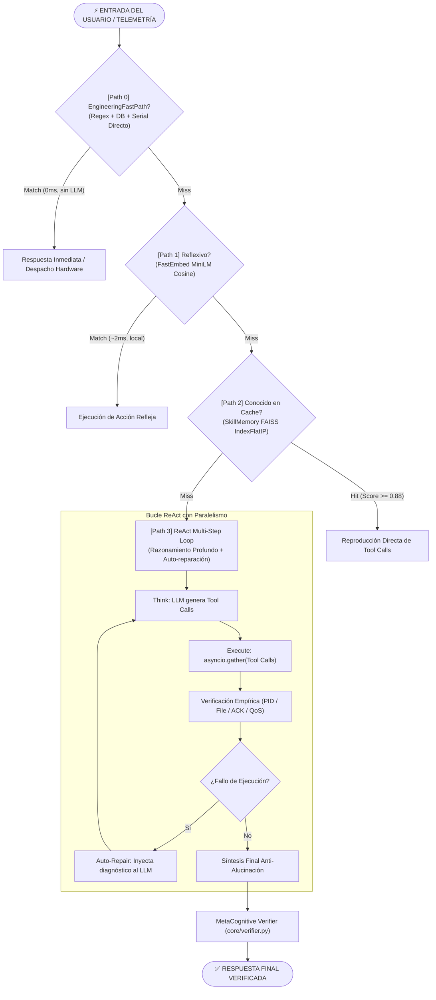
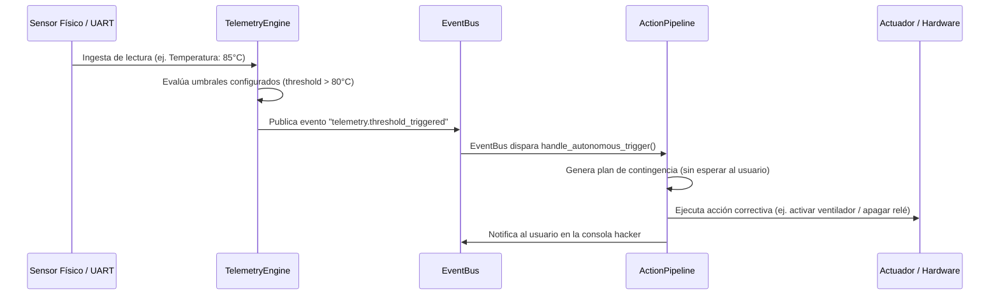

# 🧠 WIS v3.0 — Arquitectura Cognitiva y Pipeline de Ejecución

El corazón de WIS es su **ActionPipeline** ([core/pipeline.py](file:///d:/WIS/core/pipeline.py)), un motor orquestador que gestiona la cascada de razonamiento y ejecución mediante cuatro caminos cognitivos optimizados según latencia, determinismo y costo computacional.

---

## 1. Cascada Cognitiva de 4 Caminos (Latency Cascade)

---

## 2. Detalle de los Caminos Cognitivos

### Path 0: EngineeringFastPath (`core/fastpath.py`)
- **Latencia:** 0 ms (tiempo de CPU puro).
- **Consumo LLM:** Cero tokens, cero llamadas a red.
- **Alcance:** Más de 25 patrones determinísticos de ingeniería y hardware:
  - Consultas al Grafo de Dispositivos SQLite (`listar dispositivos`, `puertos activos`).
  - Mapeo y búsqueda de pinouts (`pinout de ESP32`, `gpio i2c sensor`).
  - Despacho directo a puertos serie (`enviar 'STATUS' a COM3`).
  - Comandos procedimentales memorizados (`compilar firmware`, `flashear placa`).
  - Conexión y desconexión rápida de periféricos.

### Path 1: Intención Refleja sin LLM (`core/pipeline.py`)
- **Latencia:** ~2-5 ms.
- **Mecanismo:** Reemplazó el antiguo clasificador basado en TinyLlama (que tardaba 3 segundos y sufría timeouts) por un clasificador semántico local impulsado por `fastembed` (`sentence-transformers/all-MiniLM-L6-v2`).
- **Comportamiento:** Compara la distancia coseno de la entrada contra vectores de intenciones básicas (saludos, hora del sistema, estado de recursos, apertura de aplicaciones predeterminadas). Si la similitud supera el umbral de confianza, resuelve instantáneamente sin tocar ningún modelo generativo.

### Path 2: Memoria de Habilidades Memorizadas (`core/skill_memory.py`)
- **Latencia:** ~10-15 ms.
- **Mecanismo:** Vector Index de alta velocidad basado en **FAISS IndexFlatIP** respaldado por SQLite (`Data/wis_skills.db`).
- **Comportamiento:** Cuando una secuencia multi-paso tiene éxito en Path 3, el sistema sintetiza y memoriza el grafo de llamadas resultante. Si el usuario solicita la misma tarea (o una con semántica análoga), Path 2 recupera la secuencia exacta y la ejecuta directamente, logrando velocidad instantánea en tareas recurrentes complejas.

### Path 3: ReAct Multi-Step Loop con Ejecución Paralela
Cuando la solicitud es novedosa o requiere solución de problemas compleja, se activa el bucle ReAct:
1. **Razonamiento (`core/reasoning.py`):** El LLM genera una secuencia estructurada de llamadas a herramientas (`tool_calls`).
2. **Ejecución Paralela (`asyncio.gather`):** A diferencia de arquitecturas tradicionales que ejecutan herramientas en serie, WIS evalúa las dependencias y despacha herramientas independientes en paralelo (por ejemplo: leer 4 sensores simultáneamente toma el tiempo del más lento, no la suma de todos).
3. **Verificación Empírica:** WIS **no cree en lo que el LLM afirma**. Si se lanza un proceso, comprueba `psutil.pid_exists()`. Si se escribe un archivo, comprueba tamaño y hash en disco. Si se envía un byte por UART, espera el ACK físico del microcontrolador. Si se publica por MQTT, valida el ACK de QoS.
4. **Auto-reparación Dinámica:** Si una herramienta devuelve error o no supera la verificación empírica, el error real del sistema operativo se inyecta en el contexto y el modelo formula un plan alternativo de forma autónoma.
5. **Síntesis con Trazabilidad:** La respuesta final se genera forzando un prompt de honestidad alimentado por el trace JSON de las acciones reales ejecutadas.

---

## 3. MetaCognitive Verifier (`core/verifier.py`)

Portado e integrado desde la arquitectura de vanguardia de AVRORA, el **MetaCognitive Verifier** actúa como un árbitro metacognitivo post-síntesis:
- Evalúa si la respuesta generada por el LLM declara falsamente haber completado una acción que en el trace real falló (detección de falsos positivos).
- Evalúa si el LLM afirma que una acción falló cuando en realidad las herramientas se ejecutaron satisfactoriamente (detección de falsos negativos).
- Corrige la salida antes de entregarla al usuario o al WebSocket de la interfaz.

---

## 4. Bucle Autónomo de Telemetría (Closed-Loop Proactivity)

WIS no es solo un asistente reactivo a comandos de texto; posee un lazo de control cerrado con el mundo físico:

---

## 5. Orquestación de Metas de Largo Horizonte

Para tareas que requieren minutos u horas de ejecución sostenida, WIS dispone de dos componentes avanzados:

1. **DAG Mission Planner (`core/mission.py`):**  
   Descompone objetivos masivos en un grafo acíclico dirigido (DAG) de dependencias. Cada nodo representa una etapa verificable con precondiciones y postcondiciones. Si una rama falla, no aborta el sistema completo; replanifica únicamente el subgrafo afectado.

2. **LongHorizonEngine (`core/long_horizon.py`):**  
   Daemon en segundo plano con persistencia en SQLite (`Data/wis_tasks.db`). Permite pausar, reanudar o cancelar misiones, manteniendo un diario de auditoría paso a paso (`journal`) inmune a reinicios del sistema o caídas de conexión.

3. **Swarm Coordinator (`core/swarm.py`):**  
   Permite la orquestación distribuida de múltiples agentes especializados cuando una tarea de desarrollo requiere trabajo simultáneo (ej. generación de tests mientras otro agente refactoriza el código base).

---

## 6. Síntesis y Extensión Dinámica de Habilidades (`core/skill_synthesizer.py`)

WIS es capaz de programarse a sí mismo:
1. Si un objetivo requiere una capacidad inexistente, el LLM escribe el código Python de una nueva subclase de `Ability`.
2. **Validación AST Estricta:** El analizador sintáctico AST inspecciona el código antes de cargarlo, bloqueando llamadas peligrosas (`os.system`, `subprocess.Popen` sin control, accesos indebidos al sistema de archivos).
3. **Prueba en Sandbox Virtual:** Instancia la clase en un módulo aislado en memoria y comprueba la presencia de `get_schema()` y la ejecución de `execute()`.
4. **Hot-Reload en Caliente:** Si supera el sandbox, guarda el archivo en `abilities/custom/` y lo registra dinámicamente en el `AbilityRegistry` sin necesidad de reiniciar WIS.
